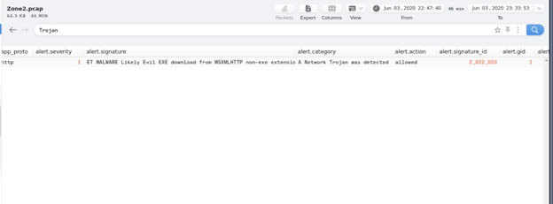
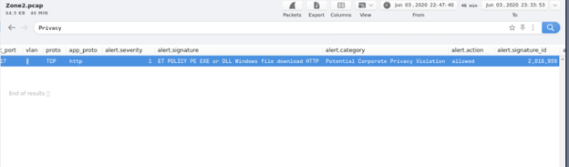
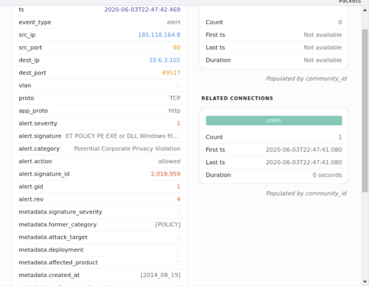
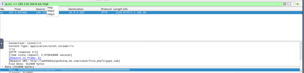
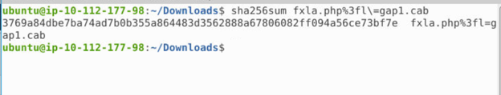
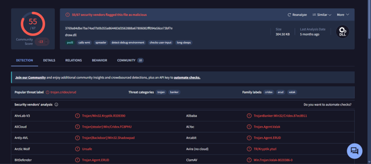
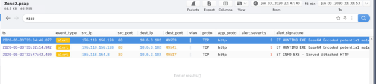
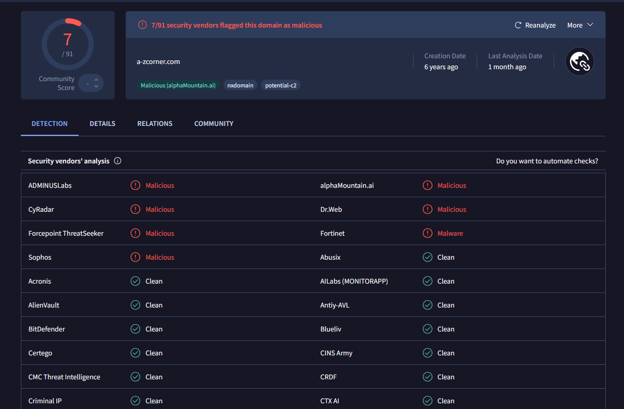
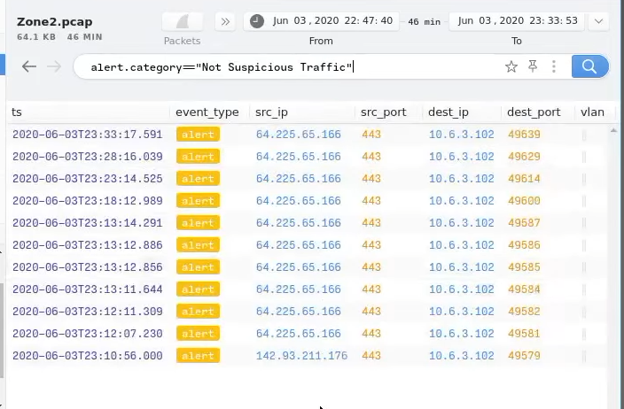
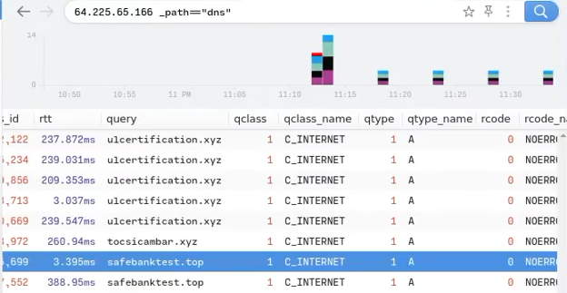

# Malware-Delivery-&-Network-Threat-Investigation

**Incident Type:** Command & Control (C2) / Malware Download  
**Status:** Completed  
**Date of Analysis:** 29 June 2026  
**Environment:** TryHackMe – Warzone Room (simulated SOC exercise)

## Executive Summary

During routine network monitoring, the IDS generated two critical alerts indicating a potential compromise of an internal host. Both alerts were validated as **true positives**. The source host (`10.6.3.102`) initiated an HTTP GET request to a malicious domain, downloading a CAB archive that contained a Windows DLL payload (`draw.dll`). The payload was identified as **Trojan.Cridex/Erud** (also known as Valak) – a banking trojan and information stealer.

Subsequent analysis of network traffic revealed additional C2 communication attempts and the presence of other malicious domains and IP addresses. The compromised host has been isolated, and network‑level blocks have been applied to all identified indicators of compromise (IoCs).

## Investigation Workflow

The investigation followed a structured SOC workflow:

1. **Alert Triage** – validate the initial IDS alerts.  
2. **Traffic Analysis** – inspect PCAP to confirm payload delivery.  
3. **Threat Intelligence** – query VirusTotal for file and domain reputation.  
4. **Correlation** – identify additional malicious activity.  
5. **IoC Extraction** – compile a comprehensive list of indicators.  
6. **Remediation** – recommend containment and prevention measures.

## 1. Alert Triage

The first alert was triggered by the signature:

> **ET MALWARE Likely Evil EXE download from MSXMLHTTP non‑exe extension M2**  
> Category: *A Network Trojan was detected*

  
*Figure 1 – Initial IDS alert: the system flagged a suspicious HTTP download using the MSXMLHTTP component, a common technique for malware droppers.*

Immediately after, a second alert fired:

> **ET POLICY PE EXE or DLL Windows file download HTTP**  
> Category: *Potential Corporate Privacy Violation*

  
*Figure 2 – Correlated alert: the same traffic was also detected as a potential policy violation because it involved a Windows executable/DLL download over plain HTTP.*

Both alerts were generated from the same source IP (`10.6.3.102`) and directed to an external IP – a strong indication of an active infection.

## 2. Alert Details & Network Context

Deepening into the alert logs, we extracted the following key fields:

| Field | Value |
|-------|-------|
| **Timestamp** | `2020-06-03T22:47:42.469` |
| **Source IP** | `185.118.164.8` (defanged: `185[.]118[.]164[.]8`) |
| **Source Port** | `80` |
| **Destination IP** | `10.6.3.102` (internal host) |
| **Destination Port** | `49517` |
| **Protocol** | TCP/HTTP |
| **Alert Signature** | `ET POLICY PE EXE or DLL Windows file download HTTP` |
| **Action** | `allowed` (the download was not blocked) |

  
*Figure 3 – Detailed alert entry showing the exact time, communicating hosts, and the specific policy signature that triggered the second alert.*

The download was allowed, meaning the file reached the endpoint – raising the urgency of the investigation.

## 3. Network Traffic Analysis – Payload Download

We examined the captured PCAP using Wireshark. Filtering for `ip.src == 185.118.164.8 && http`, we found the actual HTTP transaction:

- **Request URI:**  
  `http://avh93dhkylps5ulng-bej[.]com/czwh/fxla[.]php?l=gap1[.]cab`  
  (defanged for safety)

- **User‑Agent:**  
  `Mozilla/4.0 (compatible; MSIE 7.0; Windows NT 10.0; WOW64; Trident/8.0; .NET4.0C; .NET4.0E)`

- **Response:** HTTP/1.1 200 OK, with `Content-Type: application/octet-stream`
- **File Data:** 311,808 bytes of binary data (starting with MZ header – a Windows executable).

  
*Figure 4 – Wireshark view of the HTTP response: the server delivered a 311,808‑byte binary file, later identified as a CAB archive containing the malicious DLL.*

We extracted the file from the pcap and calculated its SHA‑256 hash.

  
*Figure 5 – Terminal output showing the SHA‑256 hash of the downloaded file: `3769a84dbe7ba74ad7b0b355a864483d356288a67606082ff094a56ce73bf7e`.*

## 4. Payload Analysis – VirusTotal & Malware Family

The hash was submitted to VirusTotal for automated analysis.

- **Detection ratio:** 55 out of 67 security vendors flagged the file as malicious.
- **Threat labels:** Trojan.Cridex/Erud, Trojan.Agent.Valak, and TrojanBanker:Win32/Cridex.
- **Behavioural highlights:**  
  - Uses `calls.wmi` for system reconnaissance.  
  - Implements anti‑debugging techniques.  
  - Performs long sleeps to evade sandbox detection.  
  - Contains spreading capabilities.

The file inside the CAB archive was named **`draw.dll`**.

  
*Figure 6 – VirusTotal report for the hash: the payload is confirmed as Cridex/Erud (Valak), a banking trojan known for credential theft and C2 communication.*

## 5. Additional Malicious Activity

Further inspection of the PCAP revealed other alerts originating from the same internal host, but targeting different external IPs:

| Timestamp | Source IP | Signature |
|-----------|-----------|-----------|
| `2020-06-03T23:02:14.942` | `176.119.156.128` | `ET HUNTING EXE Base64 Encoded potential malware` |
| `2020-06-03T23:04:46.077` | `176.119.156.128` | `ET HUNTING EXE Base64 Encoded potential malware` |
| ... | ... | ... |

These additional alerts suggest that the infected host was also contacting other C2 infrastructures.

  
*Figure 7 – List of supplementary IDS alerts indicating the host communicated with another suspicious IP (`176.119.156.128`) hosting potentially encoded malware.*

We also checked the reputation of domains observed in the traffic:

- **a-zcorner[.]com** – flagged as malicious by 7 vendors (alphaMountain.ai, Dr.Web, Fortinet, etc.) with category `potential‑c2`.

  
*Figure 8 – VirusTotal domain report for a-zcorner[.]com, which is associated with malicious activity and is likely another C2 domain used by the threat actor.*

## 6. False‑Positive Candidates – "Not Suspicious Traffic"

Curiously, the IDS also generated alerts with the category **"Not Suspicious Traffic"** for several connections. These are worth reviewing to ensure no missed IoCs.

The following IPs were labelled as "Not Suspicious":

- `64.225.65.166` (port 443) – multiple connections to `10.6.3.102`
- `142.93.211.176` (port 443) – one connection to `10.6.3.102`

  
*Figure 9 – IDS alerts flagged as non‑suspicious; however, further DNS investigation revealed they actually resolve to malicious domains.*

Examining DNS logs for `64.225.65.166`, we discovered repeated queries to:

- `ulcerification[.]xyz`
- `tosicambar[.]xyz`
- `safebanktest[.]top`

All three domains were classified as malicious by various threat intelligence sources.

  
*Figure 10 – DNS queries from the internal host to `64.225.65.166`, resolving known malicious domains: ulcerification[.]xyz, tosicambar[.]xyz, and safebanktest[.]top.*

Similarly, for `142.93.211.176`, we observed a DNS query to:

- `2partscow[.]top` (also flagged as malicious)

These findings indicate that even traffic initially marked as "not suspicious" is actually part of the malicious infrastructure, demonstrating the need for manual correlation.

## 7. Indicators of Compromise (IoC)

### Network Indicators (defanged)

| Type | Value |
|------|-------|
| **Source IP (internal)** | `10.6.3.102` |
| **Malicious IPs** | `185[.]118[.]164[.]8`, `176[.]119[.]156[.]128`, `64[.]225[.]65[.]166`, `142[.]93[.]211[.]176` |
| **Malicious Domains** | `avh93dhkylps5ulng-bej[.]com`, `a-zcorner[.]com`, `ulcerification[.]xyz`, `tosicambar[.]xyz`, `safebanktest[.]top`, `2partscow[.]top` |
| **Full URI** | `http://avh93dhkylps5ulng-bej[.]com/czwh/fxla[.]php?l=gap1[.]cab` |
| **User‑Agent** | `Mozilla/4.0 (compatible; MSIE 7.0; Windows NT 10.0; WOW64; Trident/8.0; .NET4.0C; .NET4.0E)` |

### File Indicators

| Hash (SHA‑256) | Filename | Description |
|----------------|----------|-------------|
| `3769a84dbe7ba74ad7b0b355a864483d356288a67606082ff094a56ce73bf7e` | `draw.dll` | Malicious DLL (Trojan.Cridex/Erud / Valak) |

### IDS Signatures

- `ET MALWARE Likely Evil EXE download from MSXMLHTTP non‑exe extension M2`
- `ET POLICY PE EXE or DLL Windows file download HTTP`
- `ET HUNTING EXE Base64 Encoded potential malware`
- `ET INFO EXE - Served Attached HTTP`

## 8. MITRE ATT&CK Mapping

| Technique | ID | Description |
|-----------|----|-------------|
| **Application Layer Protocol: Web Protocols** | T1071.001 | Malware used HTTP for C2 communication. |
| **Ingress Tool Transfer** | T1105 | Download of a CAB archive containing the DLL. |
| **Web Service** | T1102 | Abuse of legitimate web protocols for C2. |
| **Acquire Infrastructure** | T1583 | Use of malicious domains and IPs. |
| **Deobfuscate/Decode Files or Information** | T1140 | Payload delivered as CAB archive (likely unpacked later). |

## 9. Conclusion & Recommendations

This investigation confirmed that the internal host `10.6.3.102` was compromised and served as a victim for a Cridex/Valak trojan download. The attacker successfully delivered a malicious DLL via an HTTP request using a legitimate User‑Agent. The infection was not prevented by the IDS (alerts were set to "allowed"), indicating a gap in prevention controls.

**Recommendations:**

1. **Isolate the host** – The endpoint should be disconnected from the network until a full antivirus scan and forensic analysis are performed.
2. **Block IoCs** – Implement firewall and proxy blocks for all identified domains and IP addresses.
3. **Update IDS rules** – Change the alert action to **drop** or **reject** for these signatures if possible.
4. **Enhance endpoint detection** – Ensure EDR solutions can detect and block Cridex/Valak variants.
5. **User awareness** – Educate users about the risks of downloading files from untrusted sources (the initial vector is likely a phishing email).